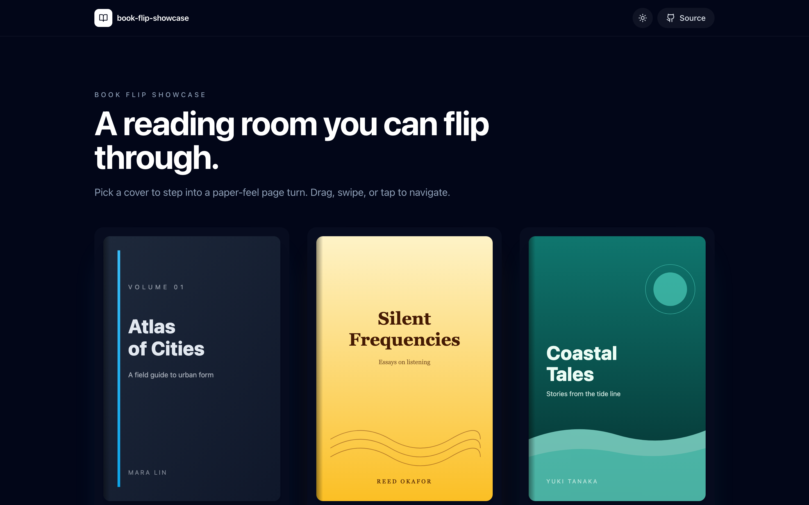
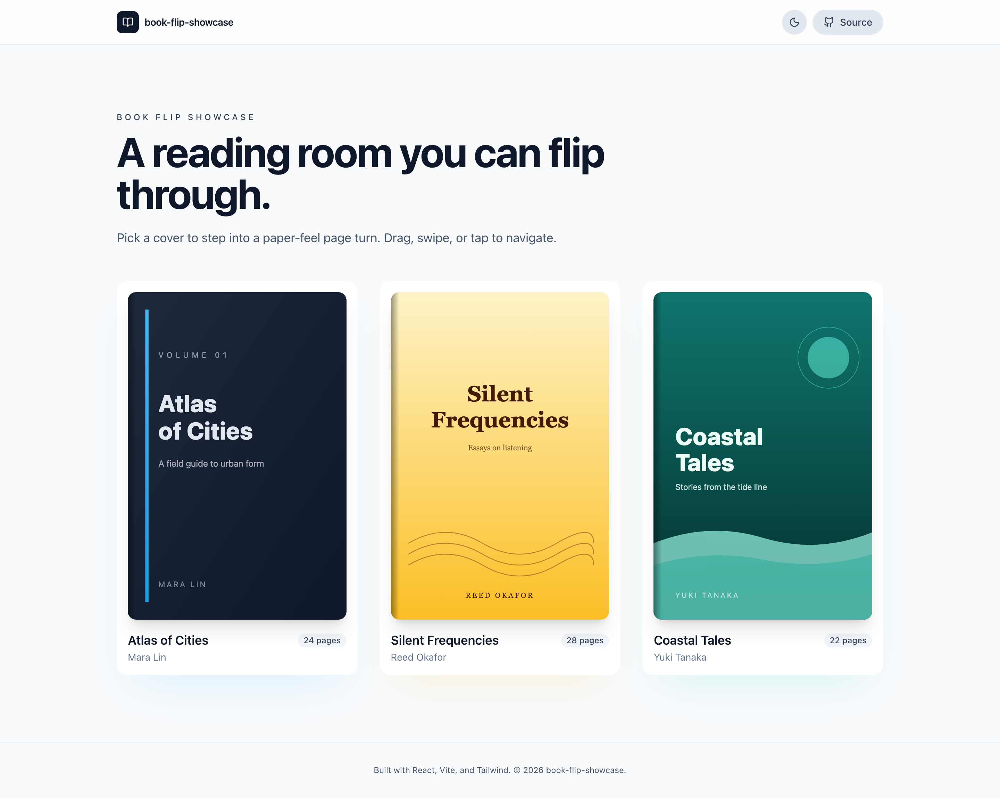
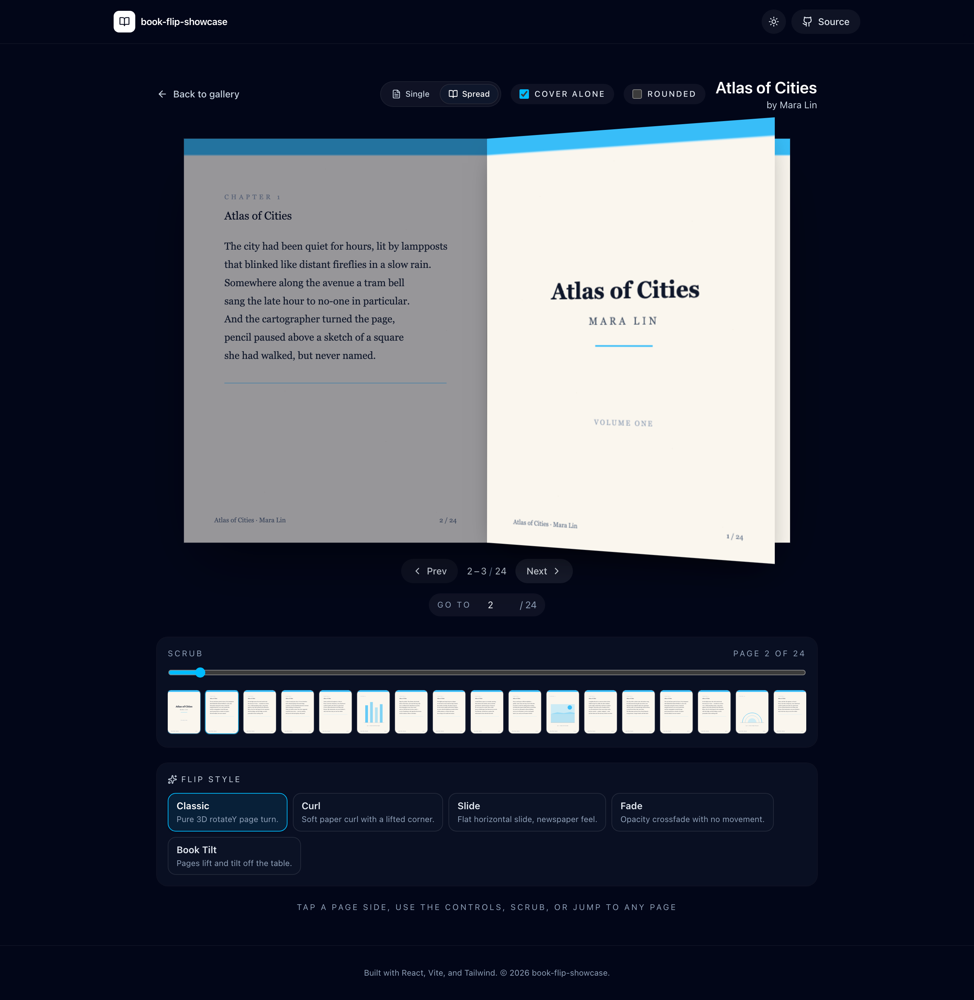
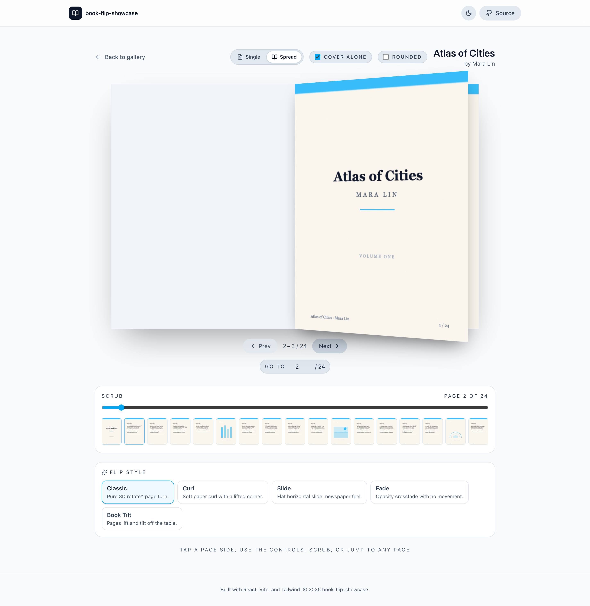

# book-flip-showcase

[](https://github.com/naturalkei/book-cover-t1/actions/workflows/ci.yml)
[](https://github.com/naturalkei/book-cover-t1/actions/workflows/deploy.yml)


> A book preview showcase site featuring a realistic paper page-flip animation experience.
> <br> Built on **React 19**, **Vite 7**, and **Tailwind CSS 4**, formatted by **ESLint 9** alone (no Prettier, no semicolons).



## Overview

`book-flip-showcase` is a single-page application that mimics the tactile feel of flipping through a physical book in the browser. It serves as both a curated gallery for book covers and an interactive demo of advanced page-turn animations.

See [`docs/plan-1.md`](./docs/plan-1.md) for the v1 product plan, scope, and milestones. See [`docs/plan-2.md`](./docs/plan-2.md) for the v1 freeze, v2 branch strategy, versioned routes, and release flow.

## Features

- **Page-flip reader** — realistic CSS 3D page-turn animation with five selectable presets (Classic, Curl, Slide, Fade, Tilt).
- **Single & spread view** — one-page or two-page spread mode with a cover-alone option that shows the jacket on its own half.
- **Curated gallery** — cover art grid with smooth transitions into the reader; each book ships with 20+ unique generated pages.
- **Multiple navigation modes** — tap either half of the spread, prev/next buttons, page jump, and a draggable thumbnail scrubber.
- **Keyboard friendly** — `ArrowLeft` / `ArrowRight`, `Home` / `End`, `Esc` shortcuts.
- **Accessible & motion-aware** — ARIA labels on all controls, axe-clean audits, respects `prefers-reduced-motion`.
- **Modern editorial UI** — generous whitespace, light/dark theme toggle, optional rounded corners for a real-book look.
- **Zero Prettier** — formatting handled entirely by ESLint 9 + `@stylistic/eslint-plugin`.
- **Strict TypeScript** — separated `app` and `node` tsconfig environments with `@/` path alias.

## Screenshots

Captured at 1440×900 @2× with spread-mode reader, cover-alone, scrubber, and flip-style picker visible.

| Gallery (dark) | Gallery (light) |
| --- | --- |
|  |  |

| Reader spread (dark) | Reader spread (light) |
| --- | --- |
|  |  |

Regenerate any time (requires the dev server on port 5173):

```bash
pnpm dev          # terminal 1
pnpm screenshots  # terminal 2
```

## Tech Stack

| Category | Technology | Version |
| :--- | :--- | :--- |
| Framework | [React](https://react.dev) | v19 |
| Build Tool | [Vite](https://vitejs.dev) | v7 |
| Styling | [Tailwind CSS](https://tailwindcss.com) | v4 |
| Language | [TypeScript](https://www.typescriptlang.org) | v5 |
| Linter | [ESLint (Flat Config)](https://eslint.org) | v9 |
| Router | [React Router](https://reactrouter.com) | v7 |
| Icons | [lucide-react](https://lucide.dev) | latest |
| Unit Tests | [Vitest](https://vitest.dev) + [Testing Library](https://testing-library.com) | v4 |
| E2E Tests | [Playwright](https://playwright.dev) + [axe-core](https://github.com/dequelabs/axe-core) | v1.60 |
| Package Manager | [pnpm](https://pnpm.io) | v10+ |

## Getting Started

### 1. Clone the repository

```bash
git clone https://github.com/<your-username>/book-flip-showcase.git
cd book-flip-showcase
```

### 2. Install dependencies

```bash
pnpm install
```

### 3. Configure environment variables (optional)

Copy `.env.example` to `.env` and adjust as needed.

```conf
VITE_BASE_URL="/{reponame}"
VITE_GITHUB_URL="https://github.com/{username}/{reponame}"
VITE_SITE_URL="https://{username}.github.io/{reponame}/"
```

### 4. Run the development server

```bash
pnpm dev
```

Open <http://localhost:5173> in your browser.

## Scripts

| Script | Description |
| --- | --- |
| `pnpm dev` | Starts the Vite development server with HMR. |
| `pnpm build` | Runs `tsc -b` type checking and builds the production bundle. |
| `pnpm serve` | Previews the production build locally. |
| `pnpm lint` | Runs ESLint across the project. |
| `pnpm lint:fix` | Auto-fixes ESLint issues where possible. |
| `pnpm test` | Runs the Vitest unit / component suite once. |
| `pnpm test:watch` | Runs Vitest in watch mode. |
| `pnpm test:coverage` | Runs Vitest with V8 coverage. |
| `pnpm e2e` | Runs the Playwright end-to-end suite headlessly. |
| `pnpm e2e:ui` | Opens the Playwright UI runner. |
| `pnpm e2e:report` | Opens the most recent Playwright HTML report. |
| `pnpm screenshots` | Captures README screenshots into `docs/media/`. |

## Project Structure

```text
book-flip-showcase/
├── .cursor/rules/       # Cursor agent rules (project conventions)
├── .github/workflows/   # GitHub Actions (ci.yml, deploy.yml)
├── docs/                # Plan, issue reports, screenshots
│   ├── plan-1.md        # Product plan & scope (source of truth)
│   ├── plan-2.md        # v1 freeze, v2 architecture, branch/release flow
│   ├── v2-improvements-over-v1.md
│   ├── issues/          # Per-issue resolution reports
│   └── media/           # README screenshots (generated by `pnpm screenshots`)
├── e2e/                 # Playwright end-to-end specs
│   ├── shared/          # Cross-version helpers
│   ├── v1/              # Frozen v1 scenarios
│   └── v2/              # v2 preview scenarios
├── public/books/        # Cover and page SVG assets
├── scripts/             # One-off utility scripts (screenshots, etc.)
├── src/
│   ├── app/             # VersionHub, root routes, legacy redirects
│   ├── v1/              # Frozen v1 gallery/reader implementation
│   ├── v2/              # v2 gallery/reader preview implementation
│   ├── test/            # Vitest setup
│   └── index.css        # Tailwind imports & global styles
├── eslint.config.ts     # ESLint 9 flat config
├── playwright.config.ts # Playwright config
├── vitest.config.ts     # Vitest config
├── tsconfig.json        # Root TS config (project references)
├── vite.config.ts       # Vite config
└── package.json
```

## Documentation

| Document | Purpose |
| --- | --- |
| [`docs/plan-1.md`](./docs/plan-1.md) | v1 product plan, milestones, and original delivery scope. |
| [`docs/plan-2.md`](./docs/plan-2.md) | v1 freeze, v2 architecture, maint branch strategy, and Pages release flow. |
| [`docs/v2-improvements-over-v1.md`](./docs/v2-improvements-over-v1.md) | Summary of v2 improvements compared with the frozen v1 baseline. |
| [`docs/issues/`](./docs/issues/) | Per-issue implementation and verification reports. |
| [`docs/media/README.md`](./docs/media/README.md) | Screenshot asset notes for README media. |

## Code Style

This project does **not** use Prettier. ESLint 9 with `@stylistic/eslint-plugin` enforces formatting:

- No semicolons — `const a = 1`
- Single quotes for TS/JS — `'hello'`
- Double quotes for JSX attributes — `<div className="box">`
- 2-space indentation
- Object curly spacing always on — `{ key: value }`
- Trailing commas on multi-line literals
- React Hooks rules strictly enforced (`react-hooks/recommended`)

To fix style issues:

```bash
pnpm lint:fix
```

See [`.cursor/rules/code-style.mdc`](./.cursor/rules/code-style.mdc) for the full style guide used by the AI agent.

## Conventions

- **Commits** follow [Conventional Commits](https://www.conventionalcommits.org/) — `feat:`, `fix:`, `docs:`, `refactor:`, `chore:`, `test:`.
- **Branches** are named `<type>/<issue-id>-<short-slug>` (or `<type>/<short-slug>` when no issue exists).
- **PRs** are squash-merged by default and must close their linked issue.

Detailed conventions live in [`.cursor/rules/`](./.cursor/rules/) for Cursor
and [`AGENTS.md`](./AGENTS.md) for Codex:

| Rule | Scope |
| --- | --- |
| `project-overview.mdc` | Project context and scope (always applied). |
| `code-style.mdc` | StandardJS formatting for `*.ts` / `*.tsx`. |
| `commit-convention.mdc` | Conventional Commits and branch naming. |
| `agent-workflow.mdc` | Mandatory loop for every requirement. |
| `testing.mdc` | Vitest and Playwright conventions. |
| `AGENTS.md` | Repository-wide Codex agent instructions derived from the Cursor rules. |

## Changelog

Release history lives in [`CHANGELOG.md`](./CHANGELOG.md). v1.0.0 (2026-05-22) ships the full Foundation → Reader MVP → Advanced Navigation → Polish → Release scope: gallery, reader with 3D flip, page-jump, keyboard shortcuts, thumbnail scrubber, light/dark theme, reduced-motion + axe-clean a11y, lazy-loaded reader chunk, and a CI + Pages deploy pipeline.

## Agent Workflow

Every requirement runs through this loop end-to-end:

1. File a GitHub issue (`gh issue create`).
2. Branch off `main` as `<type>/<issue-id>-<slug>`.
3. Write Vitest unit / component tests.
4. Write Playwright E2E scenarios.
5. Make `pnpm lint` pass.
6. Write a resolution report at `docs/issues/{issue-id}.md`.
7. Post the report to the issue (`gh issue comment`).
8. Open and squash-merge the PR (`gh pr create` → `gh pr merge --squash --delete-branch`).

See [`.cursor/rules/agent-workflow.mdc`](./.cursor/rules/agent-workflow.mdc) for the Definition of Done.

## Continuous Integration & Deployment

GitHub Actions guard `main` and deploy from `release`:

- [`.github/workflows/ci.yml`](./.github/workflows/ci.yml) — on every PR and push to `main`: `pnpm lint`, `pnpm test` (Vitest), `pnpm build`, then `pnpm e2e` (Playwright, headed Chromium with cached browsers). The Playwright HTML report is uploaded as an artifact when the suite finishes.
- [`.github/workflows/deploy.yml`](./.github/workflows/deploy.yml) — on push to `release` (or manual dispatch): installs with `--frozen-lockfile`, builds with the production `VITE_BASE_URL`, and deploys the `dist/` folder to GitHub Pages via the official `actions/deploy-pages` action.
- [`.github/workflows/release-please.yml`](./.github/workflows/release-please.yml) — on push to `release`: prepares semver release metadata and updates `CHANGELOG.md`.

To enable Pages:

1. Merge `main` into `release`.
2. In repository **Settings → Pages**, set the source to **GitHub Actions**.
3. The workflow handles the rest; status is reflected by the badges at the top of this file.

## License

This project is licensed under the MIT License — see the [LICENSE](./LICENSE) file for details.
